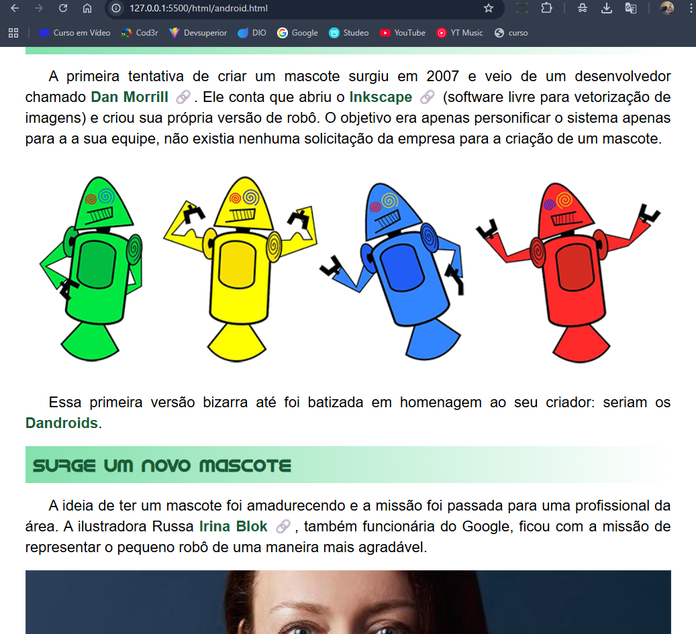
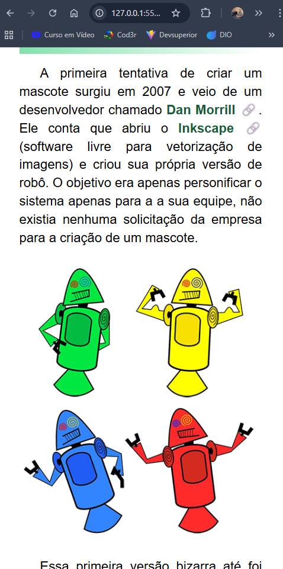
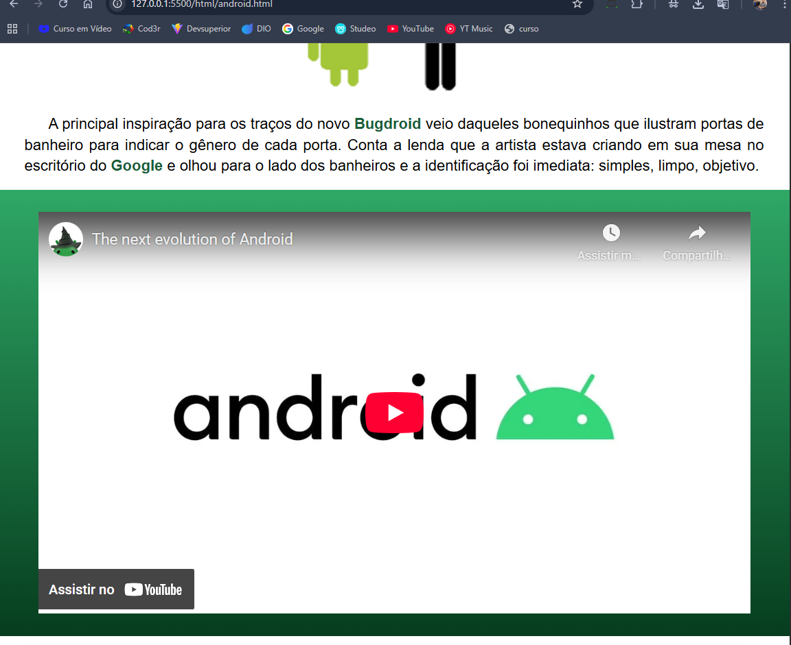
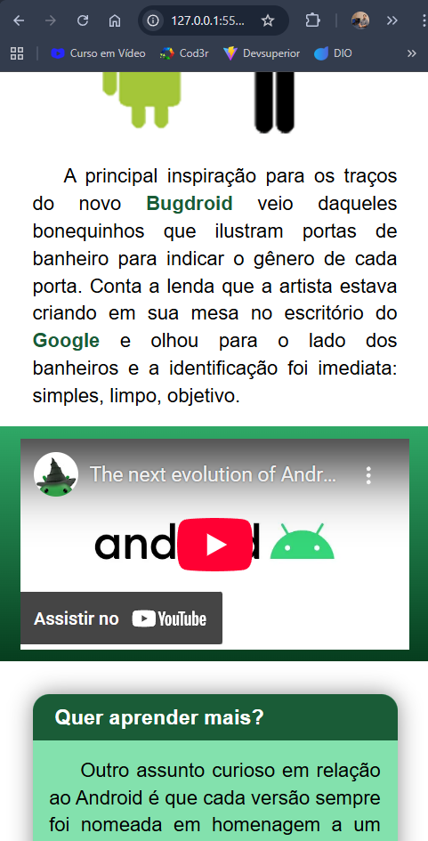
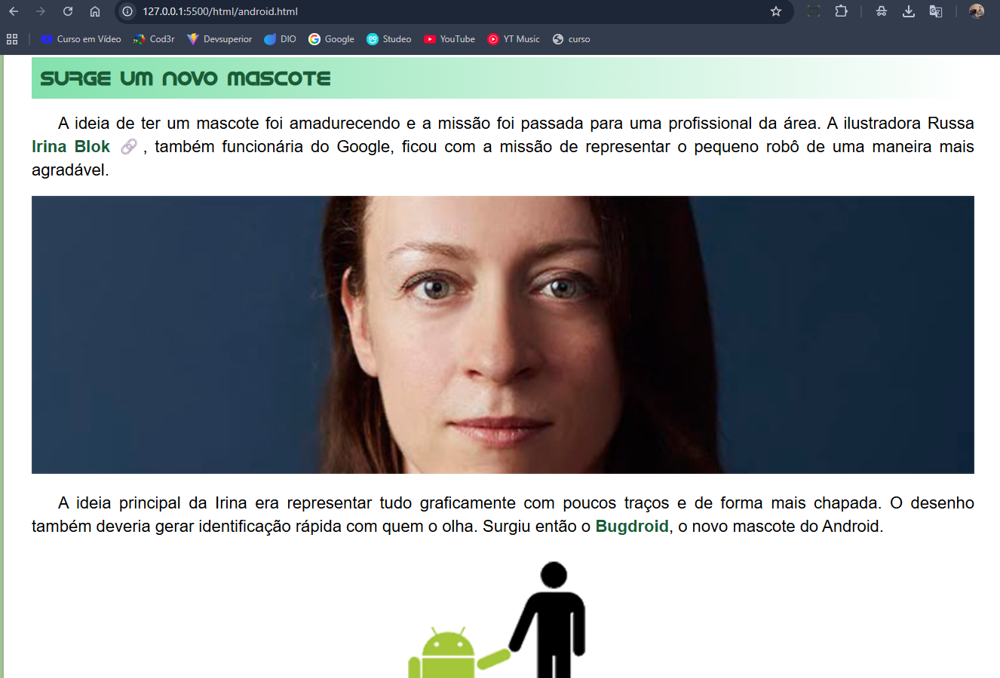
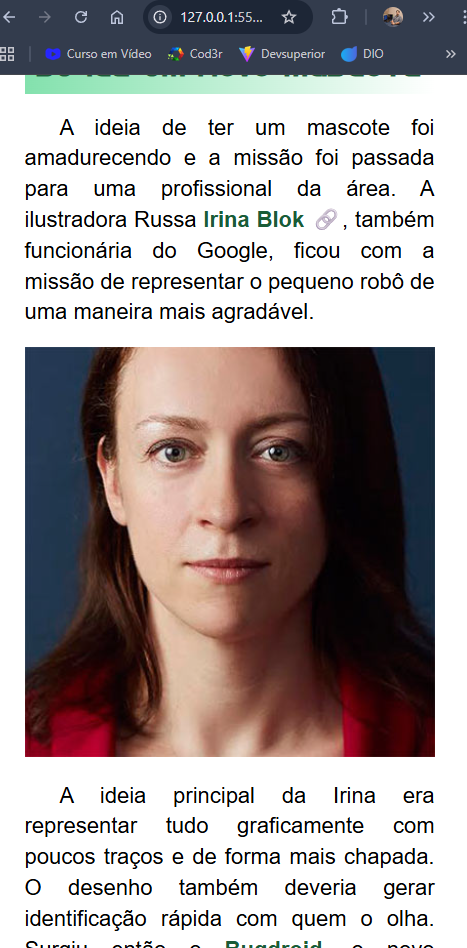

# 🌐 Página Web

Página Web criada para contar um pouco sobre a história do mascote do Android e de sua criadora.

## 🧠 Sobre o Projeto

Este projeto tem como objetivo estudar as tecnologias do HTML e CSS tornando a página web responsiva para diversos tamanhos de telas e dispositivos. Ao navegar pelo site, o usuário encontra seções dedicadas a:

- **HTML**
- **CSS**

## 🚀 Tecnologias Utilizadas

- **HTML5** – Estruturação do conteúdo
- **CSS3** – Estilização das páginas

## 📸 Demonstração

**Página Inicial**

